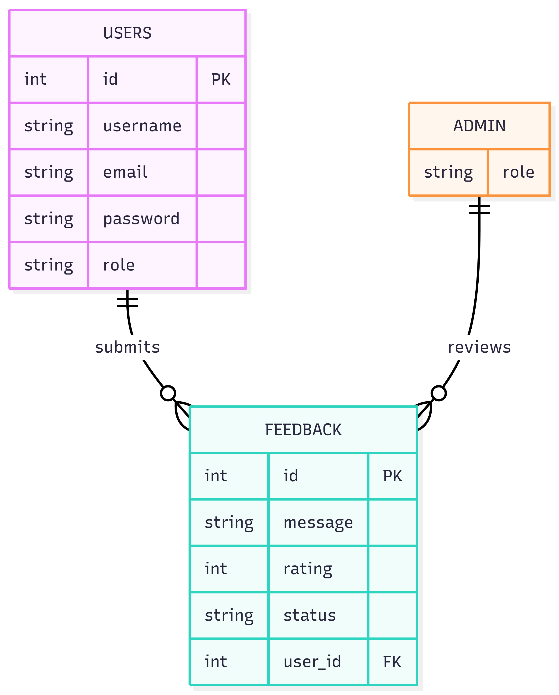

# ⭐ Feedback & Review System

A full-stack Feedback & Review System built as part of company training.
This application allows users to submit feedback and admins to review and manage feedback with role-based authentication.

# 🚀 Features

### 👤 User


- Register & Login (JWT Authentication)

- Submit feedback with rating

- View own feedback

- Logout securely

### 👑 Admin

- Login with admin role

- View all user feedback

- Update feedback status (New → Reviewed)

- Role-based access control

# 🛠 Tech Stack


### Backend

- ⚡ FastAPI

- 🗄 SQLite

- 🔐 JWT Authentication

- 🔑 Argon2 Password Hashing

- 🧩 SQLAlchemy ORM

### Frontend

- ⚛️ React + TypeScript

- 🎨 Tailwind CSS

- 🌐 Axios

- 🔐 JWT-based Auth Handling


# 📂 Project Structure

### Backend

```

backend/
├── app/
│   ├── main.py
│   ├── models.py
│   ├── schemas.py
│   ├── database.py
│   ├── auth.py
│   ├── dependencies.py
│   └── routes.py
└── requirements.txt

```

### Frontend


```


frontend/
├── src/
│   ├── api/
│   ├── auth/
│   ├── pages/
│   ├── types/
│   ├── App.tsx
│   └── main.tsx

```

## 🗄 Database Schema (ER Diagram)




# 🔐 Authentication & Authorization

- JWT tokens used for authentication

- Role (user / admin) stored inside JWT payload

# Backend enforces role-based access:

- Admin-only APIs protected using dependencies

- Frontend decodes role from token to control UI

# 🔄 Application Flow

- User/Admin registers or logs in

- JWT token is issued by backend

- Token stored in browser localStorage

- Frontend sends token in Authorization header

- Backend validates token and role

- Admin actions restricted to admin users only

# ▶️ How to Run the Project


### Backend Setup

```

cd backend

python -m venv venv

source venv/bin/activate   # Windows: venv\Scripts\activate

pip install -r requirements.txt

uvicorn app.main:app --reload

```


### Backend runs at:

```

http://localhost:8081

```

### Frontend Setup

```

cd frontend
npm install
npm run dev

```

### Frontend runs at:

```

http://localhost:5173

```

 

# 🧪 API Endpoints

### Auth

- POST /api/register

- POST /api/login

### User

- POST /api/feedback

- GET /api/my-feedback

### Admin

- GET /api/all-feedback

- PUT /api/feedback/{id}/review


# 👨‍💻 Author

```

Sai Chaitanya Koduri
Training Assignment – Feedback & Review System

```

# ⭐ Final Note

This project demonstrates secure authentication, clean architecture, and role-based access control, built without AI-generated code and fully explainable line by line.